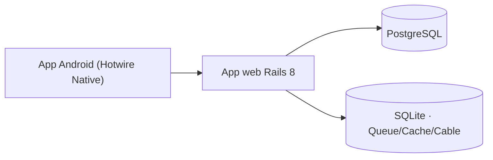

# Xannhael

> Un **template funcional** de Rails 8: una **app web** (Hotwire + Tailwind) y
> un **cliente Android** (Hotwire Native) que hablan entre sí. Clónalo,
> renómbralo y conviértelo en cualquier proyecto listo para desarrollo.

## Lo esencial en 30 segundos

- **Web**: Ruby on Rails 8, Hotwire (Turbo + Stimulus), Tailwind CSS.
- **Móvil**: cliente Android con la misma web dentro de un shell nativo.
- **Fondo**: Solid Queue / Cache / Cable (trabajos, caché y websockets sobre la
  propia base de datos).
- **Despliegue**: Docker + Kamal + Thruster.



## Quick start

Necesitas Docker + la extensión **Dev Containers** de VS Code.

Este repositorio está preparado para usar un contenedor Postgres compartido:
- **postgres-db** (puerto `55432 -> 5432`).
- **Si no lo tienes**, crea uno con:
```bash
docker run -d --name postgres-db -p 55432:5432 -e POSTGRES_PASSWORD=postgres postgres:15
```

```bash
# 1. Arranca la base de datos compartida
docker start postgres-db

# 2. Variables de entorno (solo la primera vez; .env está gitignored)
cp .env.example .env
# Rellena las claves vacías: OPENAI_API_KEY, OPENCODE_API_KEY, GITHUB_TOKEN...

# 3. En VS Code: "Dev Containers: Rebuild and Reopen in Container"
# 4. Dentro del contenedor:
bin/dev
```

Listo: web en **http://localhost:3000** y Mission Control (trabajos) en
**http://localhost:3000/jobs**.

> ¿Es la primera vez y quieres entenderlo? Lee la
> [documentación completa](docs/base/README.md) — empieza por la
> [visión general](docs/base/01-vision-general.md).

## Índice de documentación

La guía completa vive en [`docs/base/`](docs/base/README.md), un archivo por
tema. Ábrelo cuando lo necesites, sin agobios:

| # | Tema | Resumen |
|---|------|---------|
| 01 | [Visión general](docs/base/01-vision-general.md) | Stack, arquitectura y flujo |
| 02 | [Configuración](docs/base/02-configuracion.md) | Credenciales, variables de entorno, `database.yml` |
| 03 | [Puesta en marcha](docs/base/03-puesta-en-marcha.md) | Devcontainer y cómo ejecutar la app |
| 04 | [Arquitectura web](docs/base/04-arquitectura-web.md) | Rails, Hotwire, Stimulus y las rutas |
| 05 | [La suite Solid](docs/base/05-solid-suite.md) | Solid Queue, Cache, Cable y Mission Control |
| 06 | [App móvil Android](docs/base/06-app-movil.md) | Cliente Hotwire Native y el bridge |
| 07 | [Despliegue a producción](docs/base/07-despliegue.md) | Docker, Kamal y Thruster |
| 08 | [Pruebas y CI](docs/base/08-pruebas-y-ci.md) | Tests, RuboCop, Brakeman, GitHub Actions |
| 09 | [Reutilizar como template](docs/base/09-renovar-template.md) | Renombrar el repo para un proyecto nuevo |

## Tests

```bash
bin/rails db:test:prepare
bin/rails test
bin/rails lsp:check   # valida que el editor tiene Ruby LSP en marcha
```

`lsp:check` comprueba la configuración del LSP **y** hace un handshake real
con el servidor (sugerencias, navegación, símbolos). Ver
[08 · Pruebas y CI](docs/base/08-pruebas-y-ci.md#validar-el-ruby-lsp).

## Crear un proyecto nuevo desde este template

```bash
git clone <this-template-url>
cd <clone>
bin/rails scaffold:rename SLUG=blog PACKAGE=com.acme.blog
git remote add origin <tu-nuevo-repo>
git add -A && git commit
```

Detalles en [09 · Reutilizar como template](docs/base/09-renovar-template.md).

## Requisitos previos

- Docker + VS Code Dev Containers
- Un contenedor Postgres compartido `postgres-db` (puerto `55432 -> 5432`)
- Un `.env` local con tus claves: `cp .env.example .env` (gitignored; ver
  [02 · Configuración](docs/base/02-configuracion.md))

---

Documentación completa: [docs/base](docs/base/README.md) · Licencia: (añade la tuya)
