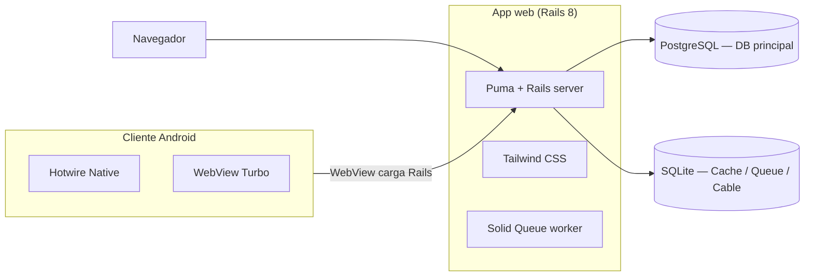
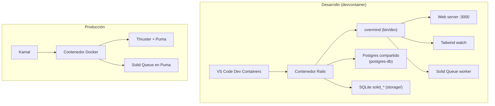
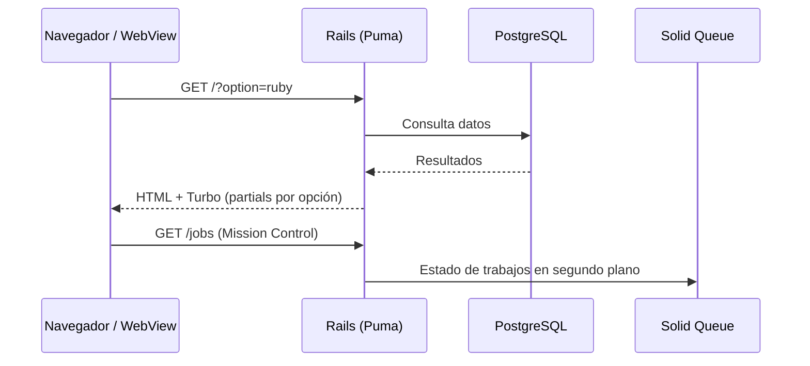

# 01 · Visión general

> **Xannhael** es un **template funcional de Rails 8** que combina una **app
> web** con un **cliente móvil Android (Hotwire Native)** que hablan entre sí.
> Está pensado para clonarlo, renombrarlo y convertirlo en cualquier proyecto:
> blog, ecommerce, SaaS, CRM…

## Stack tecnológico

| Capa | Tecnología | Rol |
|------|-----------|-----|
| Framework | Ruby on Rails 8 (Ruby 4.0.2) | Backend + render del frontend |
| Frontend | Hotwire (Turbo + Stimulus) | HTML en tiempo real, sin SPA pesada |
| Estilos | Tailwind CSS | Diseño y tema "Omarchy" |
| DB principal | PostgreSQL | Datos de la aplicación |
| Colas/caché | Solid Queue · Solid Cache · Solid Cable | Trabajos en segundo plano, caché, websockets |
| Web móvil | Hotwire Native (Android) | Shell nativo + WebView |
| Despliegue | Kamal + Thruster + Docker | Producción en un comando |

## Cómo encaja todo

## Flujo de una petición típica

## ¿Qué se explora aquí?

- **Web**: un índice con 4 secciones (Ruby, Hotwire, Kamal, Omarchy) que cambia
  según el parámetro `?option=`. Incluye cambio de tema claro/oscuro, toasts
  y navegación con Turbo.
- **Móvil**: la misma web dentro de un shell Android con barra de pestañas
  nativa, conectado por **Turbo Native bridge**.
- **Fondo**: Solid Queue expone una UI de inspección en `/jobs`.

Sigue con [02 · Configuración](02-configuracion.md).
