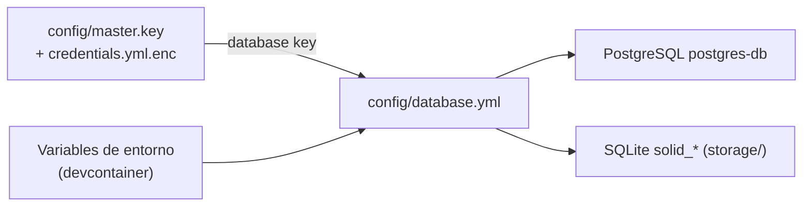
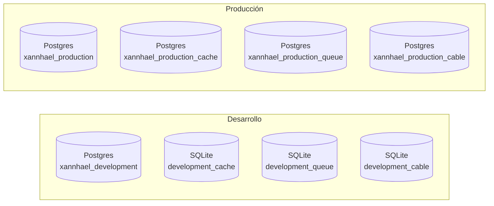

# 02 · Configuración

Esta app necesita cierta configuración para arrancar. La buena noticia: el
**devcontainer la prepara casi toda solo**. Aquí verás qué existe, por qué
existe y cuándo debes tocarla.



## 1. Credenciales de Rails (obligatorio)

`config/master.key` + `config/credentials.yml.enc` guardan datos sensibles
cifrados. El devcontainer necesita una clave `database` para conectar con el
Postgres compartido:

```yaml
database:
  host: host.docker.internal
  port: 55432
  username: postgres
  password: postgres
```

Para verlas o editarlas:

```bash
bin/rails credentials:edit
```

> ⚠️ Sin esta clave la app **no arranca**: en desarrollo, `DB_HOST` (inyectado
> por el devcontainer) hace que `database.yml` lea
> `Rails.application.credentials.database`.

## 2. El contenedor Postgres compartido (obligatorio)

La app usa un contenedor compartido llamado `postgres-db`:

```bash
docker start postgres-db
```

El `onCreateCommand` del devcontainer intenta arrancarlo automáticamente al
abrir el proyecto.

## 3. Variables de entorno

### Las inyecta el devcontainer (no hay que hacer nada)

| Variable | Para qué sirve |
|----------|----------------|
| `DB_HOST` | Activa la conexión a `credentials.database` |
| `PGHOST` / `PGPORT` / `PGUSER` / `PGPASSWORD` | Cliente `psql` + conexión |
| `SELENIUM_HOST` | Tests de sistema |
| `CAPYBARA_SERVER_PORT` | Tests de sistema |

### Opcionales (solo herramientas o despliegue)

| Variable | Usada por | Propósito |
|----------|-----------|-----------|
| `OPENAI_API_KEY` | codex | Autenticación OpenAI |
| `OPENCODE_API_KEY` | opencode | Proveedores Zen y Go |
| `KAMAL_REGISTRY_PASSWORD` | kamal | Autenticación del registry |
| `XANNHAEL_DATABASE_PASSWORD` | producción | Password de la DB en prod |

Exporta las claves de herramientas en tu shell del **host**; el devcontainer
las reenvía vía `${localEnv:...}`.

## 4. `config/database.yml`

En desarrollo:

- **`primary`** → PostgreSQL (`xannhael_development`)
- **`cache`**, **`queue`**, **`cable`** → archivos SQLite en `storage/`

En producción se separan en cuatro bases PostgreSQL dedicadas.



Prepara todo con:

```bash
bin/rails db:prepare
```

Continúa con [03 · Puesta en marcha](03-puesta-en-marcha.md).
