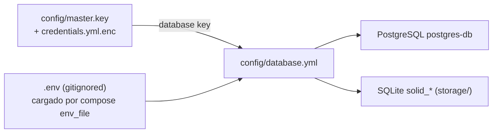
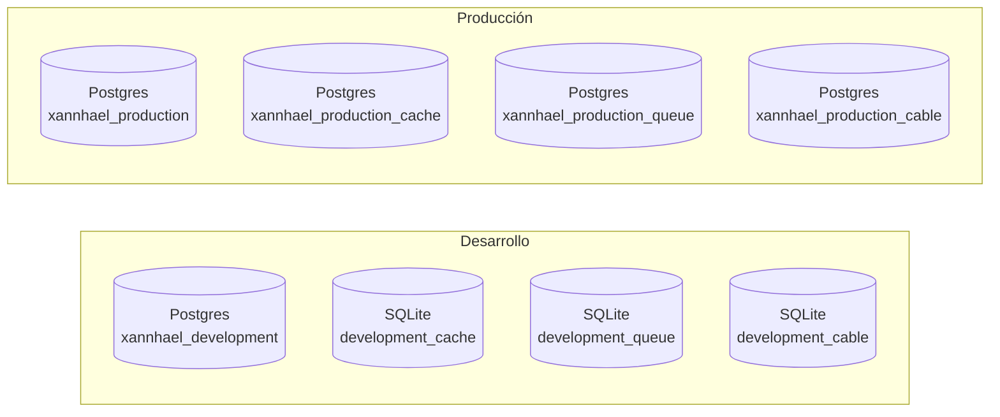

# 02 · Configuración

Esta app necesita cierta configuración para arrancar. La buena noticia: el
**devcontainer la prepara casi toda solo**. Aquí verás qué existe, por qué
existe y cuándo debes tocarla.



## 1. Credenciales de Rails (obligatorio)

`config/master.key` + `config/credentials.yml.enc` guardan datos sensibles
cifrados. El devcontainer necesita una clave `database` para conectar con el
Postgres compartido:

```yaml
database:
  host: host.docker.internal
  port: 55432
  username: postgres
  password: postgres
```

Para verlas o editarlas:

```bash
bin/rails credentials:edit
```

> ⚠️ Sin esta clave la app **no arranca**: en desarrollo, `DB_HOST` (que llega
> al contenedor desde `.env`) hace que `database.yml` lea
> `Rails.application.credentials.database`.

## 2. El contenedor Postgres compartido (obligatorio)

La app usa un contenedor compartido llamado `postgres-db`:

```bash
docker start postgres-db
```

El `postStartCommand` del devcontainer lo arranca automáticamente cada vez que
abres el proyecto.

## 3. Variables de entorno

### Fuente única: `.env`

**Todo** vive en un único `.env` en la raíz del repo. Está en `.gitignore`; lo
versionado es `.env.example`, que documenta cada variable y trae los valores de
desarrollo que ya funcionan:

```bash
cp .env.example .env   # solo la primera vez, o en cada clone nuevo
# y rellena las claves que vienen vacías (ver tabla de abajo)
```

Lo carga Docker Compose en el devcontainer mediante `env_file: ../.env` (ver
`.devcontainer/compose.yaml`). Por eso el `containerEnv` de `devcontainer.json`
está **vacío a propósito**:

> 🔒 No repitas estas claves en `containerEnv`: haría *shadowing* y
> sobrescribiría en silencio lo que pongas en `.env`.

`env_file` usa `required: false`, así que el contenedor arranca aunque falte
`.env`, pero el `postCreateCommand` te avisa con
`WARNING: .env not found — copy it with: cp .env.example .env`.

### Ya vienen rellenados (defaults de desarrollo)

| Variable | Para qué sirve |
|----------|----------------|
| `DB_HOST` | Activa la conexión a `credentials.database` (`host.docker.internal`) |
| `PGHOST` / `PGPORT` / `PGUSER` / `PGPASSWORD` | Cliente `psql` + conexión al `postgres-db` del host (puerto `55432`) |
| `SELENIUM_HOST` / `CAPYBARA_SERVER_PORT` | Tests de sistema (Selenium arranca bajo demanda) |
| `RUBY_DEBUG_OPEN` / `RUBY_DEBUG_LAZY` | Depurador remoto (`debug`) |

### Tú las rellenas (vienen comentadas/vacías en `.env.example`)

| Variable | Usada por | Propósito |
|----------|-----------|-----------|
| `OPENAI_API_KEY` | codex | Autenticación OpenAI |
| `OPENCODE_API_KEY` | opencode | Proveedores Zen y Go |
| `GITHUB_TOKEN` / `GH_TOKEN` | `gh` CLI dentro del contenedor | Evita `gh auth login` |
| `KAMAL_REGISTRY_PASSWORD` | kamal | Autenticación del registry |
| `XANNHAEL_DATABASE_PASSWORD` | producción | Password de la DB en prod |
| `DATABASE_URL` | CI | URL completa (solo GitHub Actions) |
| `RAILS_MASTER_KEY` | CI / producción | Solo si no existe `config/master.key` |

### Opcionales (comentadas; descomenta para cambiar el default)

| Variable | Default | Para qué sirve |
|----------|---------|----------------|
| `RAILS_ENV` | `development` | Entorno de Rails |
| `PORT` | `3000` | Puerto de Puma |
| `RAILS_MAX_THREADS` | `5` | Hilos/conexiones por worker |
| `WEB_CONCURRENCY` | `1` | Workers de Puma (2+ para multiproceso) |
| `SOLID_QUEUE_IN_PUMA` | `1` | Corre Solid Queue dentro de Puma (deploy único) |
| `JOB_CONCURRENCY` | `1` | Procesos worker de Solid Queue |

> Las claves de las herramientas van **en `.env`**, no en el shell del host: el
> devcontainer ya no reenvía `${localEnv:...}`.

## 4. `config/database.yml`

En desarrollo:

- **`primary`** → PostgreSQL (`xannhael_development`)
- **`cache`**, **`queue`**, **`cable`** → archivos SQLite en `storage/`

En producción se separan en cuatro bases PostgreSQL dedicadas.



Prepara todo con:

```bash
bin/rails db:prepare
```

Continúa con [03 · Puesta en marcha](03-puesta-en-marcha.md).
