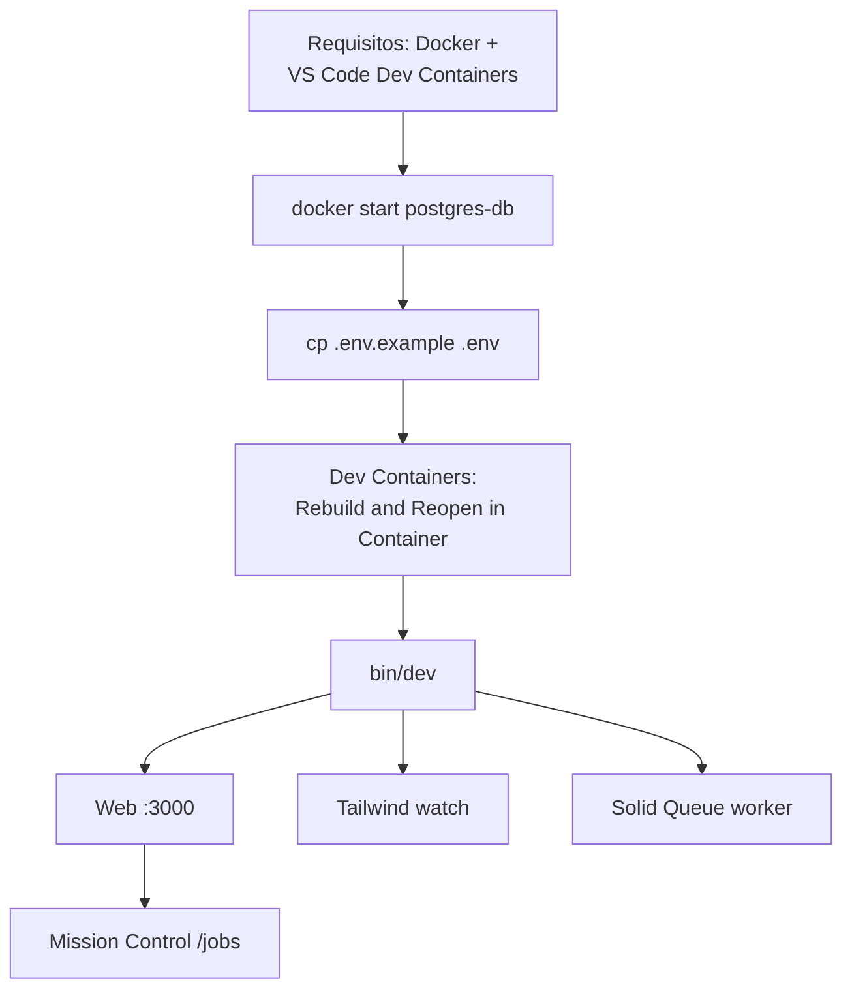

# 03 · Puesta en marcha

La forma recomendada de trabajar es con **Docker + Dev Containers de VS Code**,
porque el contenedor trae Ruby, Postgres, Tailwind, las CLIs (codex/opencode) y
las extensiones ya configuradas.



## Quick start (devcontainer)

**1. Arranca la base de datos compartida** (si no está corriendo):

```bash
docker start postgres-db
```

**2. Crea tu `.env`** (solo la primera vez, o en cada clone nuevo — es
gitignored, así que cada persona lo tiene):

```bash
cp .env.example .env
# rellena las claves vacías: OPENAI_API_KEY, OPENCODE_API_KEY, GITHUB_TOKEN…
```

**3. Abre el repo en VS Code** y ejecuta **Dev Containers: Rebuild and Reopen
in Container**. La primera compilación baja la imagen de Rails, Ruby, Node y
herramientas — tarda unos minutos.

Al crearse ejecuta el `postCreateCommand`: avisa si falta `.env`, ajusta el
propietario de los volúmenes (`chown`), crea `storage/`, comprueba `opencode
--version` y lanza `bin/setup --skip-server`.

**4. Arranca la app** desde la terminal integrada:

```bash
bin/dev
```

Esto lanza (vía **overmind**, que corre el `Procfile.dev` en una sesión tmux):

| Proceso | Comando | URL |
|---------|---------|-----|
| Servidor web | `bin/rails server` | http://localhost:3000 |
| Tailwind CSS | `bin/rails tailwindcss:watch` | — |
| Worker | `bin/rails solid_queue:start` | — |

**5. Inspecciona los trabajos** en Mission Control:
http://localhost:3000/jobs

**6. (Opcional) valida que el editor quedó cableado** — comprueba la
configuración del Ruby LSP **y** hace un handshake real con el servidor
(sugerencias, navegación, símbolos):

```bash
bin/rails lsp:check   # ver 08 · Pruebas y CI
```

## Base de datos: compartida (default) u opcional

Por defecto el compose **no** levanta ningún Postgres propio: la app usa el
contenedor compartido del host (`postgres-db`, puerto `55432 → 5432`).

Si prefieres una base **por proyecto**, en `.devcontainer/compose.yaml` tienes
el servicio `db` y su volumen `postgres-data` comentados:

1. descomentarlos,
2. poner `DB_HOST=db` en `.env` y alinear las credenciales
   (`config/database.yml` lee host/puerto/usuario/password de las credenciales
   cuando `DB_HOST` está definido),
3. recrear el contenedor y `bin/rails db:prepare`.

## Selenium (solo para tests de sistema)

Selenium **no arranca por defecto**. Si necesitas system tests:

```bash
docker compose -f .devcontainer/compose.yaml up -d selenium
```

## Herramientas incluidas en el contenedor

- **codex** (binario autónomo) y **OpenCode v2**: la versión va fijada con el
  build arg `OPENCODE_VERSION` en `.devcontainer/Dockerfile`. Para subirla,
  cambia el arg y haz **Rebuild** del contenedor.
- **overmind** + **tmux** (ejecutan el Procfile)
- **Bundler** fijado a la versión del lockfile
- Usuario no root **`vscode`** con UID/GID sincronizados con tu host
  (`updateRemoteUserUID`), así lo que creas dentro es tuyo fuera
- `libvips` + `libpq-dev` (compilan/arrancan `ruby-vips` y `pg`)
- Extensiones de VS Code: Ruby LSP, Stimulus LSP, Tailwind CSS, rdbg, Git Graph…

### Volúmenes persistentes (sobreviven a los rebuilds)

| Volumen | Qué guarda |
|---------|------------|
| `xannhael-bundle` | las gems instaladas (`/usr/local/bundle`) |
| `xannhael-user-config` | git/gh config y `opencode.json` |
| `xannhael-user-data` | sesiones de OpenCode (`opencode.db`), auth, extensiones de `gh` |
| `xannhael-user-cache` | cachés desechables (borrar si algo se corrompe) |
| `xannhael-codex` | auth y sesiones de codex |

> Todos se definen en `.devcontainer/compose.yaml` y **se renombran solos**
> cuando pasas el proyecto por `scaffold:rename` (los volúmenes Docker viejos
> quedan huérfanos — ver [09](09-renovar-template.md)).

Sigue con [04 · Arquitectura web](04-arquitectura-web.md).
