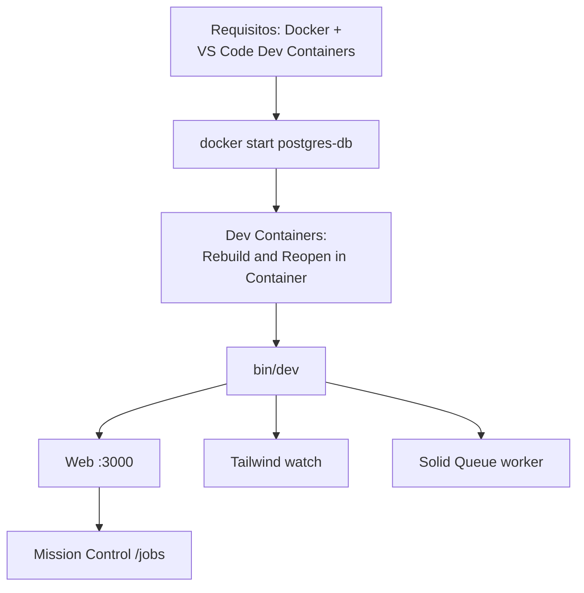

# 03 · Puesta en marcha

La forma recomendada de trabajar es con **Docker + Dev Containers de VS Code**,
porque el contenedor trae Ruby, Postgres, Tailwind, las CLIs (codex/opencode) y
las extensiones ya configuradas.



## Quick start (devcontainer)

**1. Arranca la base de datos compartida** (si no está corriendo):

```bash
docker start postgres-db
```

**2. Abre el repo en VS Code** y ejecuta **Dev Containers: Rebuild and Reopen
in Container**. La primera compilación baja la imagen de Rails Ruby, Node y
herramientas — tarda unos minutos.

**3. Arranca la app** desde la terminal integrada:

```bash
bin/dev
```

Esto lanza (vía **overmind**, que corre el `Procfile.dev` en una sesión tmux):

| Proceso | Comando | URL |
|---------|---------|-----|
| Servidor web | `bin/rails server` | http://localhost:3000 |
| Tailwind CSS | `bin/rails tailwindcss:watch` | — |
| Worker | `bin/rails solid_queue:start` | — |

**4. Inspecciona los trabajos** en Mission Control:
http://localhost:3000/jobs

## Selenium (solo para tests de sistema)

Selenium **no arranca por defecto**. Si necesitas system tests:

```bash
docker compose -f .devcontainer/compose.yaml up -d selenium
```

## Herramientas incluidas en el contenedor

- **codex** y **opencode** (binarios autónomos)
- **overmind** + **tmux** (ejecutan el Procfile)
- Bundler fijado a la versión del lockfile
- Volúmenes persistentes para sesiones de codex/opencode y auth
  (`codex-home`, `opencode-config`, `opencode-data`)
- Extensiones de VS Code: Ruby LSP, Stimulus LSP, Tailwind CSS, rdbg, Git Graph…

Sigue con [04 · Arquitectura web](04-arquitectura-web.md).
