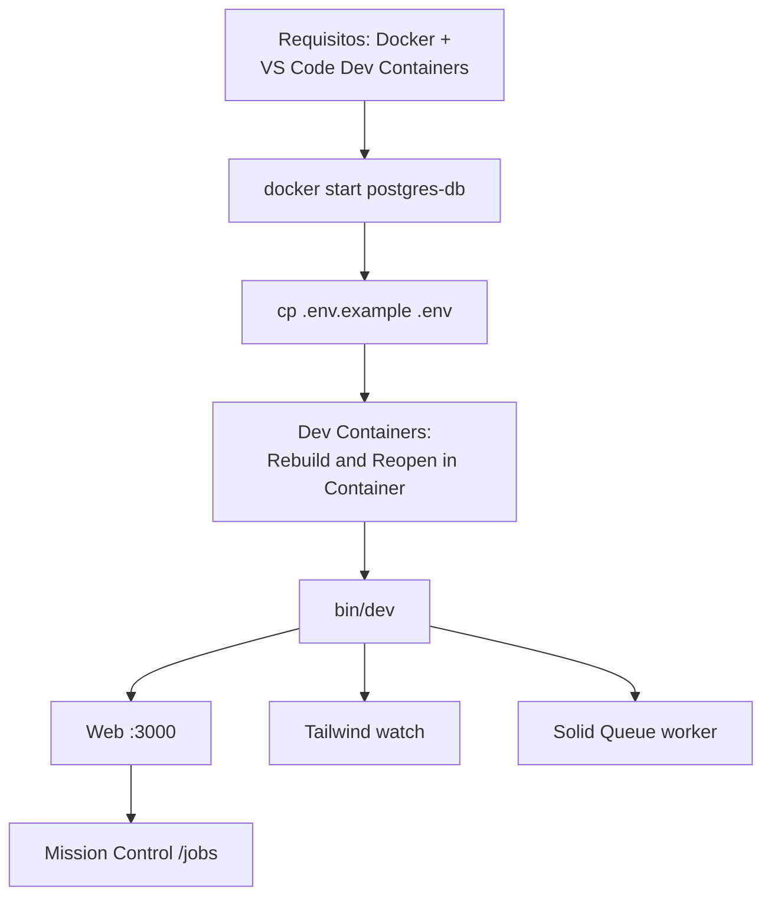

# 03 · Puesta en marcha

La forma recomendada de trabajar es con **Docker + Dev Containers de VS Code**,
porque el contenedor trae Ruby, Postgres, Tailwind, las CLIs (codex/opencode) y
las extensiones ya configuradas.


```mermaid
flowchart TD
    A["Requisitos: Docker +<br/>VS Code Dev Containers"] --> B["docker start postgres-db"]
    B --> C["cp .env.example .env"]
    C --> D["Dev Containers:<br/>Rebuild and Reopen in Container"]
    D --> E["bin/dev"]
    E --> F["Web :3000"]
    E --> G["Tailwind watch"]
    E --> H["Solid Queue worker"]
    F --> I["Mission Control /jobs"]
```

## Quick start (devcontainer)

**1. Arranca la base de datos compartida** (si no está corriendo):

```bash
docker start postgres-db
```

**2. Crea tu `.env`** (solo la primera vez, o en cada clone nuevo — es
gitignored, así que cada persona lo tiene):

```bash
cp .env.example .env
# rellena las claves vacías: OPENAI_API_KEY, GITHUB_TOKEN (o GH_TOKEN).
# OpenCode Go/Zen se autentica dentro de OpenCode con /connect.
```

**3. Abre el repo en VS Code** y ejecuta **Dev Containers: Rebuild and Reopen
in Container**. La primera compilación baja la imagen de Rails, Ruby, Node y
herramientas — tarda unos minutos.

Al crearse ejecuta el `postCreateCommand`: valida las credenciales de `codex`
y `gh`, ajusta permisos, prepara pnpm y la autenticación GitHub, instala las
gems que falten y ejecuta `bin/rails db:prepare`.

**OpenCode Go/Zen (primera vez):** abre `opencode` en la terminal, ejecuta
`/connect`, selecciona **OpenCode Go** o **OpenCode Zen** e introduce la API
key de tu plan. Después ejecuta `/models` y elige el modelo. La sesión y las
credenciales se guardan en volúmenes persistentes, por lo que sobreviven a los
rebuilds del devcontainer. No se requiere poner estas claves en `.env`.

**4. Arranca la app** desde la terminal integrada:

```bash
bin/dev
```

Esto lanza (vía **overmind**, que corre el `Procfile.dev` en una sesión tmux):

| Proceso | Comando | URL |
|---------|---------|-----|
| Servidor web | `bin/rails server` | http://localhost:3000 |
| Tailwind CSS | `bin/rails tailwindcss:watch` | — |
| Worker | `bin/rails solid_queue:start` | — |

**5. Inspecciona los trabajos** en Mission Control:
http://localhost:3000/jobs

**6. (Opcional) valida que el editor quedó cableado** — comprueba la
configuración del Ruby LSP **y** hace un handshake real con el servidor
(sugerencias, navegación, símbolos):

```bash
bin/rails lsp:check   # ver 08 · Pruebas y CI
```

## Base de datos: compartida (default) u opcional

Por defecto el compose **no** levanta ningún Postgres propio: la app usa el
contenedor compartido del host (`postgres-db`, puerto `55432 → 5432`).

Si prefieres una base **por proyecto**, en `.devcontainer/compose.yaml` tienes
el servicio `db` y su volumen `postgres-data` comentados:

1. descomentarlos,
2. poner `DB_HOST=db` en `.env` y alinear las credenciales
   (`config/database.yml` lee host/puerto/usuario/password de las credenciales
   cuando `DB_HOST` está definido),
3. recrear el contenedor y `bin/rails db:prepare`.

## Selenium (solo para tests de sistema)

Selenium **no arranca por defecto**. Si necesitas system tests:

```bash
docker compose -f .devcontainer/compose.yaml up -d selenium
```

## Herramientas incluidas en el contenedor

- **codex** (binario autónomo) y **OpenCode v2**: se instala con el instalador
  oficial V2 al reconstruir el contenedor.
- **overmind** + **tmux** (ejecutan el Procfile)
- **Bundler** fijado a la versión del lockfile
- Usuario no root **`vscode`** con UID/GID sincronizados con tu host
  (`updateRemoteUserUID`), así lo que creas dentro es tuyo fuera
- `libvips` + `libpq-dev` (compilan/arrancan `ruby-vips` y `pg`)
- Extensiones de VS Code: Ruby LSP, Stimulus LSP, Tailwind CSS, rdbg, Git Graph…

### Volúmenes persistentes (sobreviven a los rebuilds)

| Volumen | Qué guarda |
|---------|------------|
| `bundle` | Gems instaladas (`/usr/local/bundle`) |
| `agent-data` | Datos OpenCode (config, sesiones, credenciales, estado y caché) y extensiones de `gh` |

> Solo hay dos volúmenes nombrados. El código se monta desde la raíz del repo
> (`..`) en `/workspaces/project`; esa ruta interna es fija para que el
> devcontainer siga funcionando después de renombrar el proyecto.
> `XDG_CONFIG_HOME`, `XDG_STATE_HOME` y `XDG_CACHE_HOME` apuntan dentro de
> `agent-data` para conservar toda la configuración local de OpenCode.

## Git y GitHub desde el contenedor

Dentro del contenedor **no hay claves SSH** (`~/.ssh` solo tiene
`known_hosts`), así que un remote `git@github.com:...` falla siempre con
`Permission denied (publickey)`. El push va por **HTTPS** con el token de
`.env`, delegando en `gh` como helper de credenciales:

```bash
# 1. el remote debe ser HTTPS
git remote -v
git remote set-url origin https://github.com/<org>/<repo>.git

# 2. helper de credenciales SOLO para este repo
#    (el "" corta la lista heredada; así no tocamos ~/.gitconfig del host,
#     cuyo helper apunta al gh.exe de Windows y no corre en Linux)
git config credential.https://github.com.helper ""
git config credential.https://github.com.helper "!gh auth git-credential"

# 3. comprobar y empujar
gh auth status          # usa el token de .env; no necesitas `gh auth login`
git ls-remote origin    # debe listar las ramas sin pedirte nada
git push                # sin -f: el push es fast-forward
```

> ⚠️ Para subir cambios bajo `.github/workflows/` el token necesita el scope
> **`workflow`** (ver `.env.example`).

**¿Prefieres SSH?** Tendrías que crear la clave dentro del contenedor
(`ssh-keygen -t ed25519 -C "tu@email"`), añadir la pública en
GitHub → *Settings → SSH keys*, y volver a apuntar el remote a
`git@github.com:...`. Como `~/.ssh` **no está en ningún volumen**, la clave
se pierde al reconstruir el contenedor.

Sigue con [04 · Arquitectura web](04-arquitectura-web.md).
