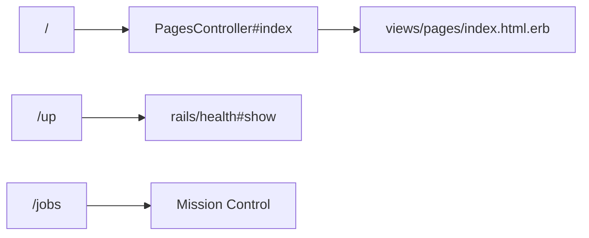
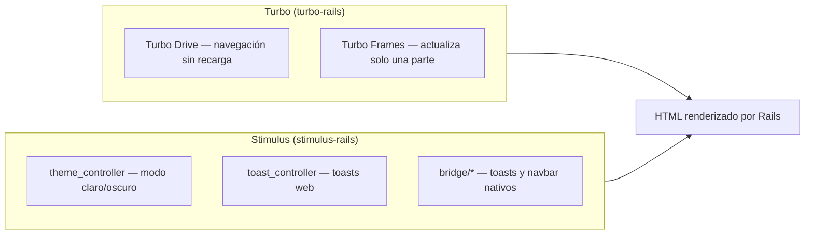
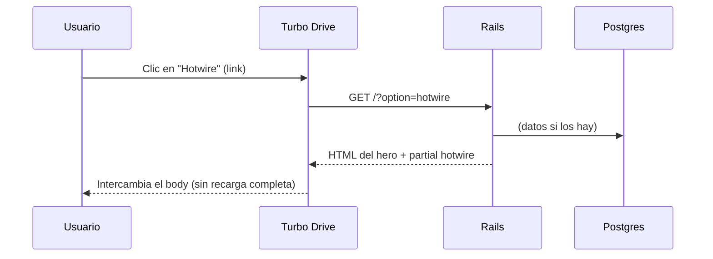

# 04 · Arquitectura web

La web es un **Rails 8 clásico con Hotwire**: el servidor renderiza HTML y
Turbo lo actualiza en tiempo real, con un poco de Stimulus para interactividad.
No hay SPA pesada ni API JSON que mantener.

## Rutas (`config/routes.rb`)

```ruby
get "up" => "rails/health#show"                       # health check
mount MissionControl::Jobs::Engine, at: "/jobs"       # UI de trabajos
root "pages#index"                                    # la raíz
```



## El controlador

`app/controllers/pages_controller.rb` lee el parámetro `option` (por defecto
`"ruby"`) y renderiza el partial correspondiente. Si llega `toast`, muestra un
mensaje nativo (ver [06 · App móvil](06-app-movil.md)).

```ruby
def index
  @option = params[:option].presence || "ruby"
  if params[:toast]
    flash.now[:notice] = t("navbar.demo_toast")
    render :toast
  end
end
```

## Vistas y localización

- La vista `index` arma un **hero** + un partial por opción:
  `pages/_ruby`, `_hotwire`, `_kamal`, `_omarchy`.
- Todo el texto vive en locales **ES/EN** (`config/locales/`), así que el
  contenido cambia de idioma sin tocar las vistas.

```mermaid
graph LR
    subgraph Views["views/pages"]
        I["index.html.erb"] --> R["_ruby.html.erb"]
        I --> H["_hotwire.html.erb"]
        I --> K["_kamal.html.erb"]
        I --> O["_omarchy.html.erb"]
    end
    I -->|t("hero.…")| L["config/locales/es.yml"]
    I -->|t("hero.…")| L2["config/locales/en.yml"]
```

## Hotwire: Turbo + Stimulus



Controladores Stimulus en `app/javascript/controllers/`:

| Controlador | Función |
|-------------|---------|
| `theme` | Alterna tema claro/oscuro |
| `toast` | Muestra un toast web (transición CSS) |
| `bridge/toast` | Envía el toast al shell Android vía Turbo Native bridge |
| `bridge/navbar` | Controla la barra de navegación nativa |
| `bridge/button` | Puente para botones nativos |

## Flujo de una petición



Continúa con [05 · La suite Solid](05-solid-suite.md).
