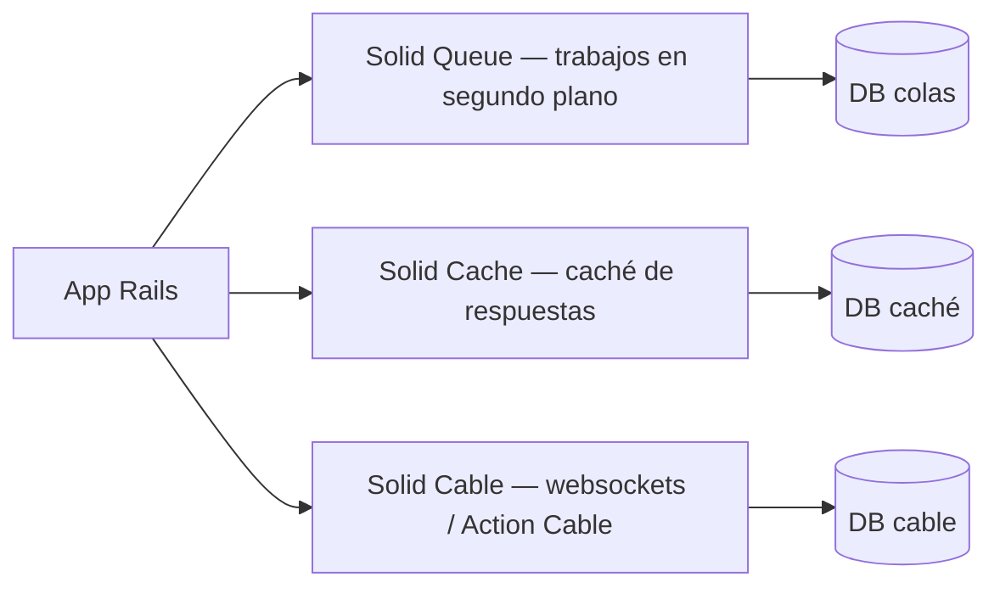
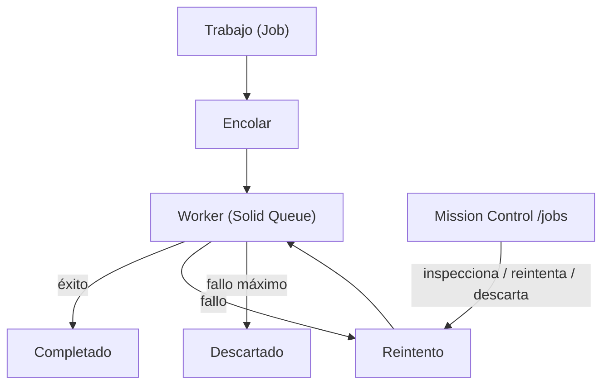

# 05 · La suite Solid

Rails 8 integra **Solid Queue**, **Solid Cache** y **Solid Cable**: tres gemas
que dan trabajos en segundo plano, caché y websockets usando la **propia base
de datos** en vez de infraestructura externa (Redis, etc.).



## Por qué bases separadas

Cada servicio vive en su propia base para no interferir con los datos de la app:

- **Desarrollo**: tres archivos SQLite en `storage/`
  (`development_cache|queue|cable.sqlite3`). Sin infraestructura extra.
- **Producción**: tres bases PostgreSQL dedicadas
  (`xannhael_production_cache|queue|cable`).

## Solid Queue

Trabajos en segundo plano con una UI de inspección integrada: **Mission
Control** en http://localhost:3000/jobs.



### Configuración (`config/queue.yml`)

```yaml
default:
  dispatchers:
    - polling_interval: 1
      batch_size: 500
  workers:
    - queues: "*"
      threads: 3
      processes: <%= ENV.fetch("JOB_CONCURRENCY", 1) %>
```

- `bin/dev` lanza el worker con `bin/rails solid_queue:start`.
- En producción, `SOLID_QUEUE_IN_PUMA: true` (config/deploy.yml) corre el
  supervisor dentro del propio proceso de Puma.

### Tareas periódicas (`config/recurring.yml`)

```yaml
production:
  clear_solid_queue_finished_jobs:
    command: "SolidQueue::Job.clear_finished_in_batches(sleep_between_batches: 0.3)"
    schedule: every hour at minute 12
```

## Solid Cache

Caché de respuestas/consultas. `config/cache.yml` define un límite de tamaño:

```yaml
default:
  store_options:
    max_size: <%= 256.megabytes %>
    namespace: <%= Rails.env %>
```

## Solid Cable

Action Cable sobre la base de datos. `config/cable.yml`:

```yaml
development:
  adapter: async
production:
  adapter: solid_cable
  polling_interval: 0.1.seconds
  message_retention: 1.day
```

> 💡 En desarrollo el adaptador es `async` (misma memoria). Si quieres ver
> actualizaciones por cable desde la consola, hazlo desde la **web console**
> del proceso dev, no desde `bin/rails console`.

Continúa con [06 · App móvil Android](06-app-movil.md).
