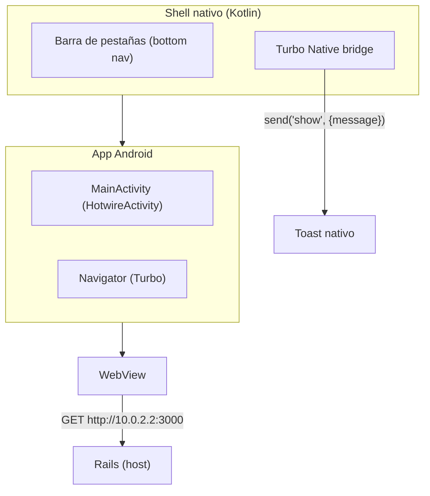
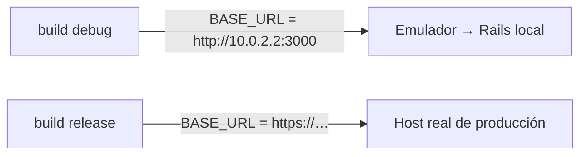

# 06 · App móvil Android

Junto a la web hay un **cliente Android hecho con Hotwire Native**. En lugar de
una app nativa completa que duplique la lógica, carga la **misma web de Rails**
dentro de un **WebView de Turbo**, y añade un **shell nativo** (barra de
pestañas, toasts, etc.) por encima.



## Estructura

```
mobile/android/
├── app/
│   └── src/main/
│       ├── java/com/creadix/xannhael/
│       │   ├── MainActivity.kt          # shell + pestañas
│       │   ├── XannhaelApplication.kt
│       │   └── bridge/                  # componentes del bridge
│       │       ├── ToastComponent.kt
│       │       ├── NavbarComponent.kt
│       │       ├── ButtonComponent.kt
│       │       └── HapticComponent.kt
│       └── res/                         # layouts, iconos, strings
├── build.gradle.kts                     # configuración Gradle
└── gradle/libs.versions.toml            # versiones de dependencias
```

## `MainActivity.kt`

Usa `HotwireActivity` y crea una barra de pestañas con **cuatro tabs**, cada
uno con su propio navigator. Cada tab apunta a la web con `?option=…`:

```kotlin
private companion object {
    val tabs = listOf(
        tab("Ruby",    R.drawable.ic_ruby,    "ruby",    R.id.ruby_navigator_host),
        tab("Hotwire", R.drawable.ic_hotwire, "hotwire", R.id.hotwire_navigator_host),
        tab("Kamal",   R.drawable.ic_kamal,   "kamal",   R.id.kamal_navigator_host),
        tab("Omarchy", R.drawable.ic_omarchy, "omarchy", R.id.omarchy_navigator_host)
    )
}
```

Al cambiar de pestaña se desvanece el contenido para que el shell se sienta
coherente con las View Transitions de la web.

## URL según el build

`app/build.gradle.kts` define la `BASE_URL` con `buildConfig`:

| Build | URL | Uso |
|-------|-----|-----|
| debug | `http://10.0.2.2:3000` | El emulador llega al Rails del host |
| release | `https://xannhael.example.com` | `ponytail:` host de ejemplo; cámbialo |



> ⚠️ Antes de publicar un build de release, cambia la URL de release por tu
> host HTTPS real.

## El Turbo Native bridge

La web puede hablar con el shell nativo. Ejemplo: el controlador
`bridge/toast` lee un atributo y envía un mensaje al Android:

```js
import { BridgeComponent } from "@hotwired/hotwire-native-bridge"

export default class extends BridgeComponent {
  static component = "toast"
  connect() {
    super.connect()
    const message = this.element.dataset.bridgeToastMessage
    if (!message) return
    this.send("show", { message })
  }
}
```

En el lado Android, `ToastComponent.kt` lo recibe y muestra un toast nativo.
El `theme_controller` web detecta `data-bridge-platform` para decidir si
renderiza toasts web o los delega al shell.

## Requisitos

- **minSdk 28**, targetSdk 35, compileSdk 36, Kotlin + AGP (ver
  `libs.versions.toml`).
- Se abre con **Android Studio** en `mobile/android` (recrea su propio
  `local.properties`).

Continúa con [07 · Despliegue a producción](07-despliegue.md).
