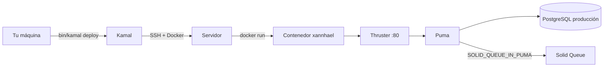
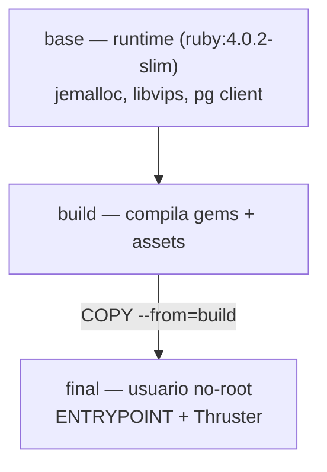
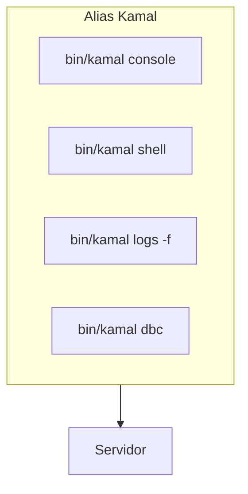

# 07 · Despliegue a producción

El despliegue usa **Docker + Kamal**: un solo comando provisiona, construye la
imagen y la lanza en cualquier servidor por SSH. Dentro del contenedor,
**Thruster** sirve los assets con caché HTTP y compresión, y delega en Puma.



## La imagen Docker (`Dockerfile`)

Construcción en dos fases:



- Variables de producción: `RAILS_ENV=production`, `BUNDLE_DEPLOYMENT=1`,
  jemalloc para menos memoria y latencia.
- Los assets se precompilan con `SECRET_KEY_BASE_DUMMY=1` (no necesita la clave
  real en build).
- Se ejecuta como **usuario no-root** (`rails`, uid 1000).
- `ENTRYPOINT` prepara la base de datos; CMD por defecto:
  `./bin/thrust ./bin/rails server` (puerto 80).

Build manual para probar:

```bash
docker build -t xannhael .
docker run -d -p 80:80 -e RAILS_MASTER_KEY=<valor de config/master.key> --name xannhael xannhael
```

## Kamal (`config/deploy.yml`)

| Sección | Valor | Nota |
|---------|-------|------|
| `service` / `image` | `xannhael` | Nombre de la app/imagen |
| `servers.web` | `192.168.0.1` | `ponytail:` IP de ejemplo, cámbiala |
| `registry.server` | `localhost:5555` | Registry de ejemplo |
| `env.secret` | `RAILS_MASTER_KEY` | Viene de `.kamal/secrets` |
| `env.clear` | `SOLID_QUEUE_IN_PUMA: true` | Jobs en el propio Puma |
| `volumes` | `xannhael_storage:/rails/storage` | Persiste assets/archivos |
| `asset_path` | `/rails/public/assets` | Puentea assets entre versiones |
| `builder.arch` | `amd64` | Arquitectura de build |

Alias útiles (vía `bin/kamal <alias>`):

```bash
bin/kamal console    # consola Rails en el servidor
bin/kamal logs       # sigue los logs
bin/kamal dbc        # dbconsole
```



## Despliegue en un comando

```bash
bin/kamal setup    # primera vez: provisiona servidor, TLS, etc.
bin/kamal deploy   # despliegues siguientes
```

> 💡 Kamal hace **despliegues progresivos sin interrupciones** y permite
> **reversiones instantáneas** si algo falla.

## Notas de producción

- La base de datos en prod es PostgreSQL con bases separadas
  (`xannhael_production[_cache|queue|cable]`) — ver [02 · Configuración](02-configuracion.md).
- La password de la DB de prod llega por `XANNHAEL_DATABASE_PASSWORD`.
- Si vas a usar varios servidores, mueve los jobs fuera de Puma a un host
  dedicado (`servers.job` con `cmd: bin/jobs`).

Continúa con [08 · Pruebas y CI](08-pruebas-y-ci.md).
