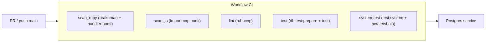

# 08 · Pruebas y CI

## Pruebas locales

La suite usa **Minitest** (estándar de Rails). Primero prepara la base de
pruebas y luego ejecuta:

```bash
bin/rails db:test:prepare
bin/rails test
```

Tests de sistema (necesitan Selenium corriendo — ver [03 · Puesta en marcha](03-puesta-en-marcha.md)):

```bash
bin/rails test:system
```

## Verificación de código

| Comando | Qué hace |
|---------|----------|
| `bin/rubocop` | Estilo Ruby (RuboCop) |
| `bin/brakeman --no-pager` | Escaneo estático de vulnerabilidades Rails |
| `bin/bundler-audit` | Vulnerabilidades en gems |
| `bin/importmap audit` | Vulnerabilidades en dependencias JS |
| `bin/rails lsp:check` | Ruby LSP: configuración + handshake real (~26 s) |

### Validar el Ruby LSP

Cuando el editor "no da sugerencias" **no lo detectan ni los tests ni RuboCop**:
el fallo suele estar en la extensión de VS Code o en su configuración. Esta
tarea comprueba las dos capas y sale con código `1` si algo falla:

```bash
bin/rails lsp:check
```

**Fase 1 · configuración** (milisegundos):

- `rubyLsp.rubyVersionManager` en `.devcontainer/devcontainer.json` debe ser un
  **objeto** `{ "identifier": "none" }` — la extensión 0.10.x crashea con el
  formato string heredado (`Cannot create property 'identifier' on string`).
- Igual en `~/.vscode-server/data/Machine/settings.json` (VS Code lo lee antes
  que `devcontainer.json`).
- `.ruby-lsp/Gemfile` sin `gem "ruby-lsp"` en duplicado con el `Gemfile`
  principal (Bundler aborta: *"You cannot specify the same gem twice"*).
- Gem `ruby-lsp` instalada + extensión `shopify.ruby-lsp` presente.

**Fase 2 · servidor** (~26 s): arranca `bundle exec ruby-lsp` por stdio y hace
un handshake LSP auténtico — `initialize`, espera el indexado, y pide
`completion` (con trigger `.`), `definition`, `hover` y `documentSymbol` sobre
un buffer virtual. Es exactamente lo que hace el editor cuando escribes.

```bash
# caso verde
bin/rails lsp:check   # RESULTADO: OK · 13 comprobaciones   (exit 0)

# si rompes el formato del setting, lo atrapa y sale con exit 1:
#   ❌ devcontainer.json usa el formato string "none" … Usa { "identifier": "none" }
```

> Ejecútala tras tocar la config del editor/devcontainer, al clonar el
> template, o siempre que sospeches que "dejó de funcionar el LSP".

## GitHub Actions

`.github/workflows/ci.yml` corre en cada **push a `main`** y en cada **PR**:



| Job | Comandos | Notas |
|-----|----------|-------|
| `scan_ruby` | `brakeman` + `bundler-audit` | Seguridad |
| `scan_js` | `importmap audit` | Seguridad JS |
| `lint` | `rubocop` | Cachea `tmp/rubocop` |
| `test` | `db:test:prepare test` | Con servicio Postgres |
| `system-test` | `test:system` | Sube `tmp/screenshots` si falla |

Notas del workflow:

- `scan_js` instala **`libvips`** antes de arrancar: `bin/importmap` levanta la
  app y `ruby-vips` es FFI (sin `libvips.so.42` falla con *"Could not open
  library 'vips'"*).
- `test` y `system-test` instalan **`libpq-dev` + `libvips`** (compilan `pg` e
  `image_processing`).
- Acciones a la última (`actions/checkout@v7`).
- **No valida el Ruby LSP**: eso es local — `bin/rails lsp:check` (arriba).

```bash
bin/ci   # corre todo el pipeline localmente
```

Continúa con [09 · Reutilizar como template](09-renovar-template.md).
