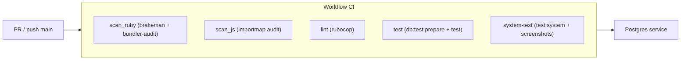

# 08 · Pruebas y CI

## Pruebas locales

La suite usa **Minitest** (estándar de Rails). Primero prepara la base de
pruebas y luego ejecuta:

```bash
bin/rails db:test:prepare
bin/rails test
```

Tests de sistema (necesitan Selenium corriendo — ver [03 · Puesta en marcha](03-puesta-en-marcha.md)):

```bash
bin/rails test:system
```

## Verificación de código

| Comando | Qué hace |
|---------|----------|
| `bin/rubocop` | Estilo Ruby (RuboCop) |
| `bin/brakeman --no-pager` | Escaneo estático de vulnerabilidades Rails |
| `bin/bundler-audit` | Vulnerabilidades en gems |
| `bin/importmap audit` | Vulnerabilidades en dependencias JS |

## GitHub Actions

`.github/workflows/ci.yml` corre en cada **push a `main`** y en cada **PR**:



| Job | Comandos | Notas |
|-----|----------|-------|
| `scan_ruby` | `brakeman` + `bundler-audit` | Seguridad |
| `scan_js` | `importmap audit` | Seguridad JS |
| `lint` | `rubocop` | Cachea `tmp/rubocop` |
| `test` | `db:test:prepare test` | Con servicio Postgres |
| `system-test` | `test:system` | Sube `tmp/screenshots` si falla |

```bash
bin/ci   # corre todo el pipeline localmente
```

Continúa con [09 · Reutilizar como template](09-renovar-template.md).
