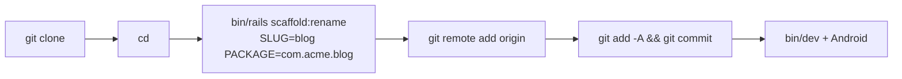
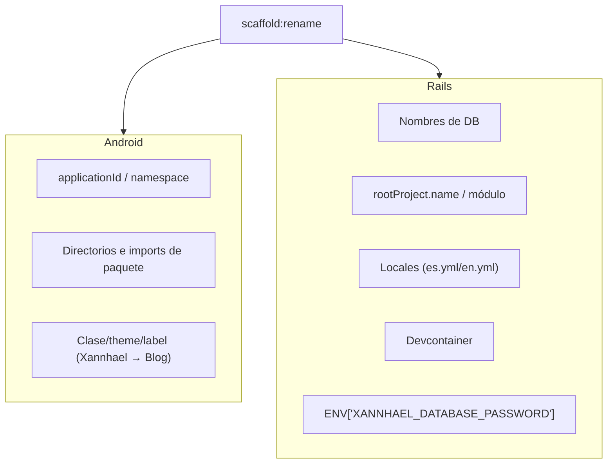

# 09 · Reutilizar como template

Xannhael es un **template de trabajo**: web Rails + cliente Android que hablan
entre sí. Para empezar un proyecto nuevo (blog, ecommerce, SaaS, CRM…) se
**clona y se renombra en el lugar** con `scaffold:rename`.



## Uso

```bash
git clone <this-template-url>
cd <clone>
# Renombra Android + Rails en el lugar y elimina el remote 'origin'
bin/rails scaffold:rename SLUG=blog PACKAGE=com.acme.blog

git remote add origin <tu-nuevo-repo-url>
git add -A && git commit
```

### Opciones

| Opción | Descripción | Default |
|--------|-------------|---------|
| `SLUG` | Nuevo slug (minúsculas, ej. `blog`). Nombres de DB, rootProject, URLs | Nombre de la carpeta |
| `PACKAGE` | Nuevo `applicationId`/namespace Android, ej. `com.acme.blog` | `com.example.<slug>` |
| `STRIP_SECRETS=1` | También borra `master.key` + `credentials.yml.enc` | Conservadas |

> 🔎 La tarea **detecta los nombres antiguos del contenido del repo** (el
> namespace Android y el módulo Rails), no de la carpeta. Así funciona aunque
> el template se llamara de otra forma.

## Qué renombra



## Qué NO toca

- **`.git`** — conserva el historial; solo elimina el remote `origin`.
- Archivos locales/generados: `local.properties`, `build/`, `.gradle/`,
  `.idea/`, `log/`, `tmp/`, `storage/`, `.ruby-lsp/`.
- **Credenciales** (`master.key`, `credentials.yml.enc`) — se conservan porque
  el devcontainer las necesita para arrancar. Pasa `STRIP_SECRETS=1` para
  borrarlas y después ejecuta `bin/rails credentials:edit`.

## Después de renombrar

1. `git remote add origin <tu-nuevo-repo-url>`
2. `git add -A && git commit`
3. `bin/dev` + abre la app Android desde `mobile/android` (Android Studio
   recrea su propio `local.properties`)

> Si usaste `STRIP_SECRETS=1`, ejecuta `bin/rails credentials:edit` y añade la
> clave `database` (ver [02 · Configuración](02-configuracion.md)).

Detalles completos en `lib/tasks/scaffold.rake`.
